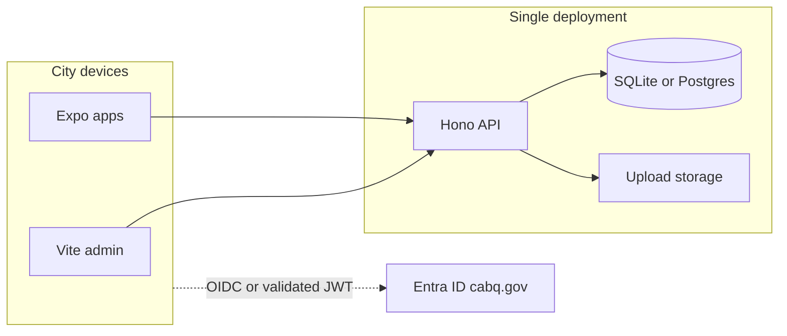

# Backend deployment and identity (city employees)

This document describes how the Call Pat **API** should be deployed for city employee use, whether **on employee laptops vs centralized servers**, **cloud vs on‑prem**, how **@cabq.gov** (Microsoft Entra ID) fits in, and **phased next steps**. It complements [REVIEW.md](./REVIEW.md) (feature scope) and [SETUP.md](./SETUP.md) (local developer setup).

---

## 1. Executive summary

- **One centralized backend** should serve all clients (web admin, mobile). The current stack uses a **single Node process**, **SQLite**, and **local file storage** for uploads—designed for **one deployment**, not many independent copies.
- **Installing the API separately on each employee’s PC is not recommended** for production: each instance would have its own database and files, so there would be **no shared report queue** and **no operational consistency**.
- **Cloud vs on‑prem** is a **policy and compliance** decision (IT/security, procurement, data residency). Both can work technically if there is **one** reachable HTTPS endpoint and proper **secrets**, **TLS**, and **backups**.
- **@cabq.gov sign-in** for production implies **Microsoft Entra ID** (Azure AD) integration. The **prototype does not implement this**; it uses **demo JWT** login only. Production requires **additional engineering** (see [§5](#5-identity-cabqgov--entra-id) and [§10](#10-engineering-backlog-production)).

---

## 2. Current architecture (as implemented)

| Layer | Location | Notes |
|--------|----------|--------|
| API | `packages/api` | Hono on Node.js |
| Database | SQLite via `better-sqlite3` | `DATABASE_URL` (default `file:./data/callpat.db` relative to API cwd) |
| Uploads | Filesystem | `UPLOAD_DIR` (default `./uploads`) |
| Auth | JWT (HS256) | Secret: `DEMO_JWT_SECRET`; tokens issued by `POST /auth/demo-login` with seeded demo users—not Entra ID |

**References:** `packages/api/src/auth.ts`, `packages/api/src/app.ts`, `packages/api/src/db/`.

**Implication:** SQLite and uploads assume **one writer** and **one disk** unless you introduce replication or migrate to a shared database—**not** part of this prototype.

---

## 3. Deployment models

### 3.1 Per-employee “local backend” (not recommended for production)

| Approach | Result |
|----------|--------|
| Each laptop runs its own API + SQLite | Isolated data; **no shared queue**; N backup problems; mobile cannot point at “the” city system without manual URLs. |

Use **local installs** only for **developer testing**, not as the city’s production pattern.

### 3.2 Single server on city network (on‑prem VM)

| Element | Guidance |
|---------|----------|
| Topology | One **Windows or Linux VM** (or physical server) in the datacenter or VLAN |
| Runtime | Node.js 20+, `npm run build` then `node` or `npm run start` for `@call-pat/api` |
| Edge | **TLS** termination at **IIS**, **nginx**, or **Apache**; reverse proxy to Node on localhost |
| Access | City **intranet** and/or **VPN**; firewall allowlists as required |

**Verdict:** **Reasonable** when public cloud is not allowed, as long as there is still **one** deployment and operational **backup** and **patching**.

### 3.3 Approved cloud (municipal or commercial per contract)

Examples (non-prescriptive): **Azure** (including Azure Government if required), **AWS GovCloud**, or other **city-approved** regions and contracts.

**Verdict:** Often easier for **TLS**, **scaling**, **monitoring**, and **managed databases** later; must satisfy **data residency**, **BAA**, **CJIS**, or other **organizational baselines** as applicable.

### 3.4 Target topology (conceptual)

Clients use **one HTTPS origin** (e.g. `https://callpat.cabq.gov/api` or similar) via `VITE_API_URL` and `EXPO_PUBLIC_API_URL`.

---

## 4. Network and security

| Topic | Guidance |
|-------|----------|
| **Transport** | **HTTPS only** in production; no plaintext API over the internet. |
| **Secrets** | Replace default `DEMO_JWT_SECRET` with a **cryptographically random** secret from a vault; rotate on compromise. After Entra integration, API may validate **Azure AD-issued JWTs** using Microsoft’s keys (different from shared HS256 demo tokens). |
| **Firewall** | Restrict admin/dispatcher surfaces if policy requires (e.g. city IP ranges or VPN). |
| **Rate limiting** | Add at reverse proxy or application layer for `POST /auth/*` and upload endpoints (not in prototype). |
| **Uploads** | [REVIEW.md](./REVIEW.md) lists **virus scanning** as out of scope for the prototype; production should define **max size**, **MIME allowlist**, and **scanning** per city policy. |
| **Logging** | Centralize access and error logs; avoid logging full JWTs or PII unnecessarily. |

---

## 5. Identity (@cabq.gov / Entra ID)

### 5.1 Current prototype

- Login is **`POST /auth/demo-login`** with fixed emails (`reporter@demo.local`, etc.) from seed data.
- **No** validation that the user is a real **@cabq.gov** account.

### 5.2 Production direction

Require that only **city identities** (typically **@cabq.gov**) can use the system:

1. **Microsoft Entra ID** (Azure AD) as the identity provider for the tenant that owns `@cabq.gov` mail.
2. **App registration** in Entra ID for Call Pat:
   - **Web (Vite):** SPA or confidential client with redirect URIs for your deployed admin URL.
   - **Mobile (Expo):** MSAL / system browser flow with redirect URI / custom scheme aligned with Expo ([mobile build docs](../apps/mobile/docs/BUILD_IOS.md)).
3. **API validation:** Either:
   - **Validate Azure AD access tokens** (OIDC JWKS, issuer, audience, `tid`/`oid` claims), then map **groups or app roles** to Call Pat roles (`employee`, `dispatcher`, `admin`), or  
   - **Backend OAuth code exchange** (less common for SPAs) depending on architecture chosen with security.
4. **Disable or remove** `demo-login` in production builds or protect it behind **environment flags** only in non-production.

Directory **groups** (e.g. “Call Pat Dispatchers”) are the usual way to assign **dispatcher/admin** vs default **employee**.

---

## 6. Hosting checklist (single deployment)

Use this when provisioning the **one** production or pilot host.

| Step | Action |
|------|--------|
| 1 | Install **Node.js 20+** LTS. |
| 2 | Clone or deploy artifact; run **`npm install`** at repo root, **`npm run build`** (or build only `packages/api` per your pipeline). |
| 3 | Set **`DATABASE_URL`**, **`UPLOAD_DIR`**, **`PORT`**, **`DEMO_JWT_SECRET`** (or post-Entra equivalent). |
| 4 | Run **`npm run db:push`** / migrations and **seed** only in controlled environments (avoid demo users in prod or replace with real provisioning). |
| 5 | Process manager: **systemd**, **PM2**, **Windows Service**, or **container** with restart policy. |
| 6 | Reverse proxy: TLS cert (ACME or enterprise PKI), proxy to `127.0.0.1:PORT`. |
| 7 | Health check: **`GET /health`** should return `200` for load balancers. |
| 8 | Point web and mobile env vars at this **single base URL**. |

---

## 7. Backup and recovery

| Asset | Approach |
|-------|----------|
| **SQLite** | File-level backup of `callpat.db` (consistent snapshots or brief maintenance window); test restore. |
| **Future PostgreSQL** | Automated dumps or managed backup; document RTO/RPO with DB team. |
| **Uploads** | Backup `UPLOAD_DIR` with same cadence as DB; restore together for consistency. |
| **Secrets** | Store in vault/KMS; document rotation. |

Placeholders: define **RTO/RPO** with stakeholders.

---

## 8. Mobile and web configuration (production API URL)

| Client | Variable | Example |
|--------|----------|---------|
| Web admin | `VITE_API_URL` | `https://api.city.example.gov` |
| Expo | `EXPO_PUBLIC_API_URL` | Same origin as API base used by clients |

For **EAS builds**, set secrets per [apps/mobile/docs/BUILD_IOS.md](../apps/mobile/docs/BUILD_IOS.md) and [BUILD_ANDROID.md](../apps/mobile/docs/BUILD_ANDROID.md). Production binaries must **not** embed `localhost`.

---

## 9. Phased next steps (programmatic)

1. **Stakeholder alignment** — Confirm **single centralized** backend; rule out **per-laptop** production installs; choose **cloud vs on‑prem** with IT.
2. **Identity workshop** — Entra admins: app registration, test users/groups, **@cabq.gov** domain rules.
3. **Pilot environment** — One VM or cloud slot, TLS, restricted network if required, monitoring.
4. **Security review** — Threat model, data classification, retention, access reviews.
5. **Engineering** — Implement Entra-backed auth; harden secrets; optional Postgres migration; operational runbook.

---

## 10. Engineering backlog (production)

Track these as implementation work (not done in the demo prototype):

| Item | Description |
|------|-------------|
| **Entra ID / OIDC** | App registration; validate Azure AD JWTs on API or complete SPA auth flow per security review. |
| **Retire demo login** | Remove or strictly gate `POST /auth/demo-login` outside non-prod. |
| **Role mapping** | Map Entra groups or app roles to `employee` / `dispatcher` / `admin`. |
| **Secrets** | Vault-managed `DEMO_JWT_SECRET` successor; no defaults in production. |
| **Optional Postgres** | If HA or multi-instance is required, migrate from SQLite with Drizzle. |
| **Upload policy** | Size limits, MIME validation, antivirus integration. |
| **Observability** | Structured logging, metrics, alerting. |

---

## 11. Cloud vs on‑prem decision criteria

Use this table with IT/security and procurement; **no single vendor is assumed**.

| Criterion | Cloud (approved region/contract) | On‑prem VM |
|-----------|----------------------------------|------------|
| Data residency / compliance | Must match city attestation (e.g. Gov cloud, region locks) | Data stays in city-controlled DC |
| Identity (Entra) | API reaches `login.microsoftonline.com`; standard pattern | Same; API still needs outbound HTTPS to Microsoft |
| Operations | Often faster cert scaling, managed DB options | City owns patching, HA, storage |
| Cost | Opex, subscription model | Capex + staff time |

**Recommendation:** Pick **one** hosting model for **pilot**, document **exit criteria** for scaling (e.g. move to Postgres, second region) after measured load.

---

## Related documents

- [REVIEW.md](./REVIEW.md) — Review scope and out-of-scope security items  
- [SETUP.md](./SETUP.md) — Local development  
- [apps/mobile/docs/BUILD_IOS.md](../apps/mobile/docs/BUILD_IOS.md) / [BUILD_ANDROID.md](../apps/mobile/docs/BUILD_ANDROID.md) — Mobile production builds  
- [apps/mobile/docs/MONITORING_EAS.md](../apps/mobile/docs/MONITORING_EAS.md) — EAS build monitoring  
